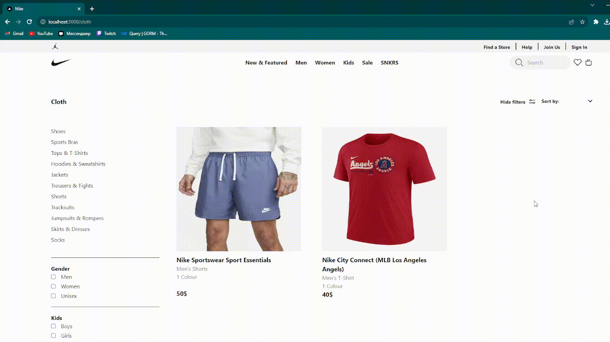
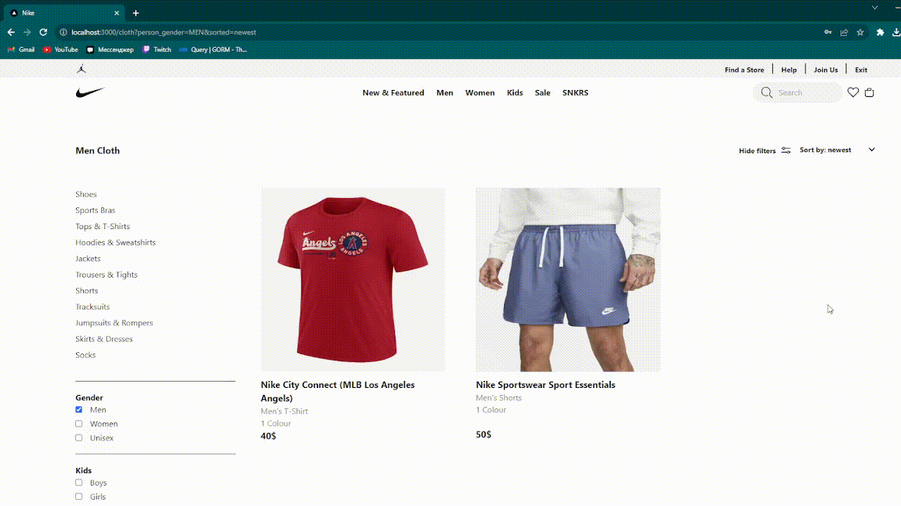
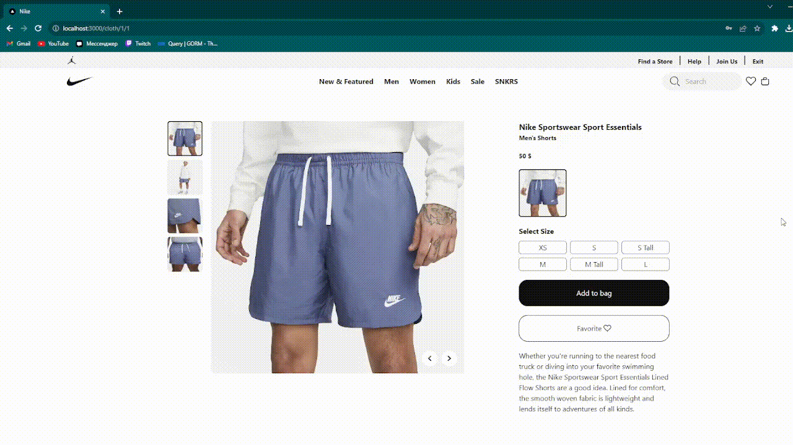
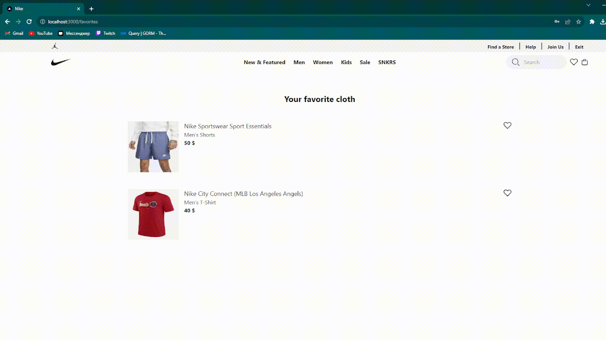
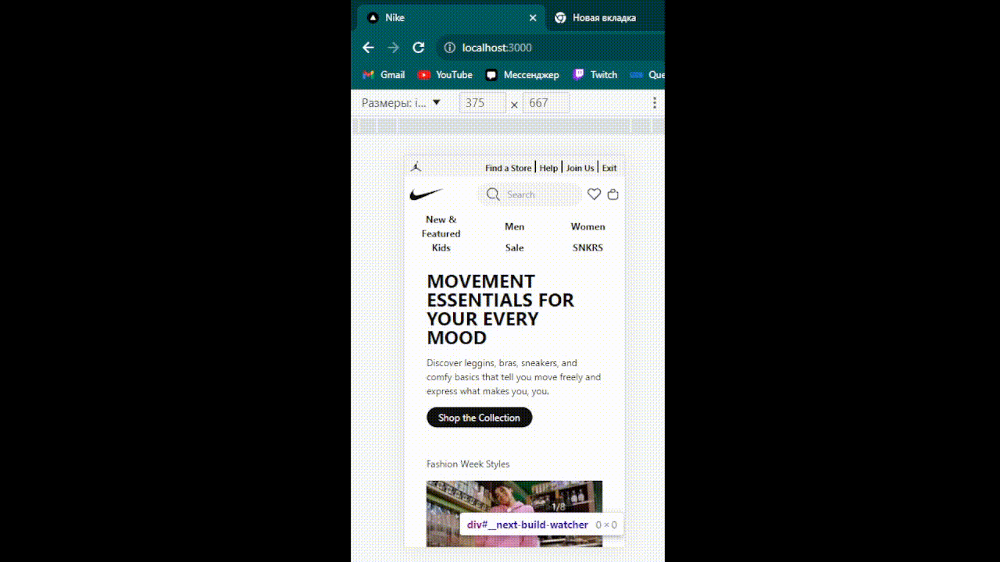

# Projekt - kópia internetového obchodu Nike.com

## Stack

* Frontend:
    + Next.js
    + Typescript
    + Tailwind
* Backend
    + Golang - knižnice GIN a Gorm
    + PostgreSQL

## Implementovaná funkcionalita

### Hlavná stránka

Boli vytvorené vlastné zoznamy s nekonečným scrollovaním aj bez neho. Pomocou generík je možné
vytvárať zoznamy z rôznych typov prvkov a komponentov.

### Katalóg oblečenia

* Filtre podľa typu oblečenia
* Triedenie podľa ceny vzostupne/zostupne a podľa noviniek
* Vyhľadávanie podľa názvu

### Stránka produktu

* Fotografie oblečenia
* Dostupné farebné varianty oblečenia
* Možnosť pridať oblečenie do obľúbených alebo do košíka

### Košík

* Možnosť odstrániť oblečenie z aktuálneho košíka
* Možnosť zaplatiť aktuálny košík
* Možnosť zobraziť predchádzajúce zaplatené objednávky

### Obľúbené oblečenie

### Autorizácia, registrácia a autentifikácia

Autentifikácia je implementovaná pomocou JWT tokenu.

### Responzivita pre rôzne typy zariadení

